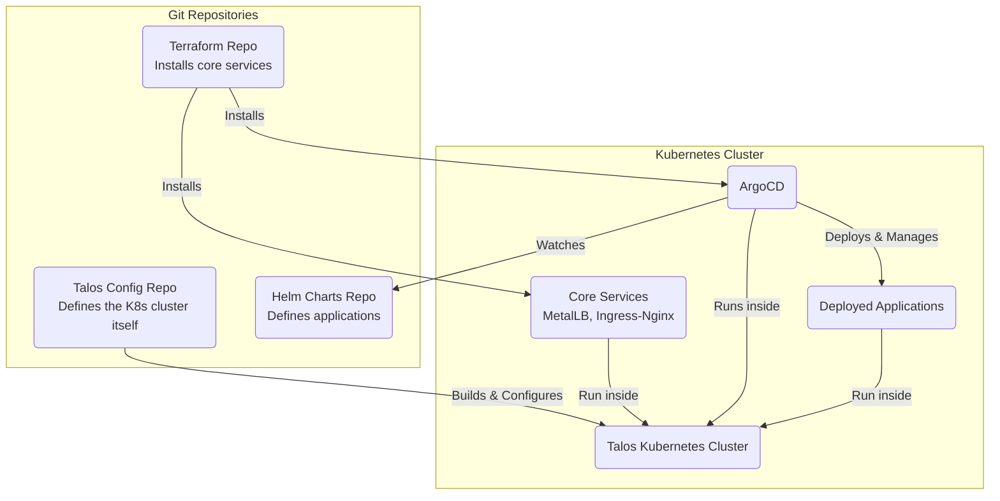

# GitOps K8s Lab

This is the main repo for my Kubernetes home lab, fully automated using Talos, Terraform, and ArgoCD.

## Cluster Hardware

This cluster runs on the following hardware:

| Hostname | Role | CPU Cores | RAM (GB) | Storage | Model/Type |
| :--- | :--- | :---: | :---: | :--- | :--- |
| `talos-m1` | Master | 2 | 4 | 128 GB SATA SSD | Fujitsu Futro S920 |
| `talos-mw1` | Master + Worker | 6 | 16 | 256 GB NVMe | Lenovo ThinkDesk M920q |
| `talos-mw2` | Master + Worker | 6 | 16 | 1TB NVMe | HP EliteDesk 600 G4 Mini |

## How It Works

The setup is split into three Git repos:

1.  **[Talos Config Repo](https://github.com/davidlesicnik/homelab-talos)**: Creates the Talos cluster and bootstraps the K8s cluster.
2.  **[Terraform Repo](https://github.com/davidlesicnik/homelab-tf)**: Uses Terraform to install core services like MetalLB, Ingress-Nginx, and ArgoCD and to set up the storages.
3.  **[Helm Charts Repo](https://github.com/davidlesicnik/homelab-argo)**: Contains all the application Helm charts that ArgoCD deploys and manages.

## High-Level Setup

Each repository contains its own detailed `README` with the specific commands and configurations.

### 1. Build the Cluster

Start with the **[Talos Config Repo](https://github.com/davidlesicnik/homelab-talos)**. Follow its instructions to provision your machines and stand up the Kubernetes cluster.

### 2. Bootstrap Core Services

Once the cluster is online, head to the **[Terraform Bootstrap Repo](https://github.com/davidlesicnik/homelab-tf)**. Its `README` will guide you through applying the Terraform configuration to install ArgoCD and other essentials.

### 3. Let ArgoCD Deploy Everything

That's it. ArgoCD is configured to watch the **[Helm Charts Repo](https://github.com/davidlesicnik/homelab-argo)** and will begin deploying your applications automatically. From now on, you'll manage your apps simply by pushing changes to that repo.